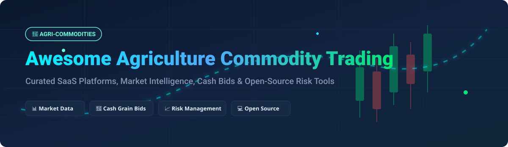

# Awesome Agriculture Commodity Trading 🌾 Analytics & Risk Management Ecosystem 📈

  
  
  
  

## 🌟 Top Agricultural Commodity Trading Ecosystem

**Curated List of SaaS Platforms & Open-Source GitHub Projects** 🚀  
*Focused on Agricultural Commodity Markets, Grain Trading, Price Intelligence, Cash Bids, Market Data, Futures & Ag Trade Execution* 📊

**Last updated: September 2026** 📅

---

This repository tracks top-tier **SaaS platforms** and **open-source projects** for **Agricultural Commodity Trading**. These systems provide real-time market data, price intelligence, trading execution, cash grain bids, supply chain visibility, risk management, and quantitative analytics for traders, elevators, processors, and agribusinesses worldwide. 🚜🌾

---

## 📑 Table of Contents
- [🏢 Market Sector Overview](#-market-sector-overview)
- [💻 SaaS/Hosted Platforms](#-saashosted-platforms)
- [🔓 Open-Source GitHub Projects](#-open-source-github-projects)
- [🤝 How to Contribute](#-how-to-contribute)
- [💖 Support & Sponsorship](#-support--sponsorship)
- [⚠️ Disclaimer](#%EF%B8%8F-disclaimer)
- [📈 Star History](#-star-history)

---

## 🏢 Market Sector Overview

> [!NOTE]  
> **Market Size & Structure**: The global Commodity Trading and Risk Management (CTRM) software market size for agricultural commodities is estimated at **$1.8 Billion to $2.5 Billion USD** (with the broader ag-tech market exceeding $22 Billion). The sector is **moderately fragmented**: global market data and futures brokerage execution are concentrated among legacy financial giants (e.g., StoneX, DTN, Barchart), whereas grain procurement, localized cash bid distribution, and digital trade workflows remain fragmented across specialized regional tech vendors and ag-marketplaces.

---

## 💻 SaaS/Hosted Platforms

The table below lists leading commercial SaaS and enterprise platforms, sorted by estimated company annual revenue/valuation (descending). 📊

| Company / Product 🏢 | Estimated Scale / Revenue / Valuation 💰 | Specific Pricing 💵 | Free Tier / Trial Limit ⏳ | Key Features & Focus 🎯 |
| :--- | :--- | :--- | :--- | :--- |
| **[StoneX Platform](https://www.stonex.com/)** | **~$132.38 Billion** Annual Operating Revenue (Public: NASDAQ: SNEX) | Custom institutional brokerage rates & clearing fees | **No free trial** (Institutional demo on request) | Global commodities execution, risk management, clearing, and cash bid intelligence. |
| **[DTN ProphetX](https://www.dtn.com/agriculture/agribusiness/prophetx/)** | **~$284.8 Million** Annual Revenue (Owned by TBG AG) | Quotes start ~$150 – $300/mo depending on data feeds & terminal seats | **14-Day Free Demo Trial** upon sales request | Enterprise market intelligence, real-time cash grain bids, weather & decision support. |
| **[Barchart cmdtyView](https://www.barchart.com/cmdty/trading/cmdtyview)** | **~$50 Million – $100 Million** Est. Revenue | Premier: $29.95/mo; cmdtyView Lite/Pro: $129.00 – $499.00/mo | **30-Day Free Trial** for Barchart Premier / Partial-month trial for cmdtyView | Leading grain pricing, physical cash bids, charting, and futures execution workspace. |
| **[CQG](https://www.cqg.com/)** | **~$50 Million – $80 Million** Est. Revenue | CQG Desktop from $25/mo + $0.25/contract; Pro/One from $100+/mo | **14-Day Free Demo Trial** (Simulated trading account) | Advanced futures trading, technical analysis, algorithmic order routing, and charting. |
| **[Vesper](https://vespertool.com/)** | **~$10 Million – $25 Million** Est. Revenue / Series A | Modular plans starting approx. €450/mo (~$490/mo) for Core intelligence | **7-Day Free Trial** / Live interactive demo available | AI-driven commodity price forecasting, proprietary market benchmarks, and trade flow data. |
| **[AgFlow](https://www.agflow.com/)** | **~$5 Million – $15 Million** Est. Revenue | Subscription plans from ~$350/mo; custom enterprise data feeds | **Free Weekly Market Signal Brief** (Demo available on request) | Physical agricultural market intelligence, OTC prices, freight rates, and import/export flows. |
| **[AgriDigital](https://www.agridigital.io/)** | **~$5 Million – $10 Million** Est. Revenue | Growers: Free; Grain Elevators/Traders: from $99/mo up to custom tiers | **Free for Growers** / **14-Day Free Trial** on Onfarm tools | Digital grain transaction management, grain tracking, supply chain finance, and inventory. |
| **[GeoGrain & GrainBridge](https://www.geograin.com/)** | **~$5 Million** Est. Revenue | Custom agribusiness contract pricing | **No public free trial** (Sales demo provided) | Cash grain bids database, producer grain marketing tools, and elevator management integrations. |
| **[ClearAg](https://www.clearag.com/)** | Ag Intelligence Business Unit | API pricing starting ~$500/mo based on query volumes | **30-Day API Trial Key** for developers | Environmental, weather, and soil intelligence customized for ag trading and harvest risk. |

---

## 🔓 Open-Source GitHub Projects

Below are top open-source projects, quantitative engines, and tools usable for agricultural commodity trading, supply chain management, and risk modeling. Sorted by GitHub Stars_Count (descending). 🌟

*Note: Click on any Stars_Badge to visit the stargazers page of that repository.*

- **[OpenBB Terminal](https://github.com/OpenBB-finance/OpenBBTerminal)**  
    
  Comprehensive open-source investment research and financial terminal. Includes dedicated modules for commodity prices, futures curves, macroeconomic data, and technical analysis. 📊

- **[Microsoft Qlib](https://github.com/microsoft/qlib)**  
    
  AI-oriented quantitative investment platform for machine learning-based price forecasting, backtesting, and market risk analysis in commodity and equity markets. 🤖

- **[Zipline](https://github.com/quantopian/zipline)**  
    
  Event-driven backtesting engine for trading strategies. Supports historical futures data and custom agricultural commodity benchmark backtests. ⏳

- **[Goldman Sachs GS-Quant](https://github.com/goldmansachs/gs-quant)**  
    
  Python toolkit for quantitative finance, risk analytics, and derivatives pricing. Useful for structuring commodity hedges and options strategies. 🐍

- **[QuantLib](https://github.com/lballabio/QuantLib)**  
    
  The quantitative finance standard library for yield curves, commodity futures modeling, volatility surfaces, and derivatives pricing. 📐

- **[Open Food Network](https://github.com/openfoodfoundation/openfoodnetwork)**  
    
  Open-source online marketplace platform connecting local agricultural producers, food hubs, and regional distributors for farm produce trade (AGPL). 🚜

- **[Marketcetera](https://github.com/Marketcetera/marketcetera)**  
    
  Open-source enterprise algorithmic trading engine providing FIX protocol connectivity, order routing, and strategy execution for commodity markets. ⚡

- **[SFRM – Spot & Futures Risk Management](https://github.com/cn-vhql/SFRM)**  
    
  Lightweight open-source spot and futures hedging risk management tool for physical bulk commodity arbitrage and position tracking. 📦

---

## 🤝 How to Contribute

We welcome community contributions! Follow these steps to add new SaaS platforms or open-source projects: 💡

1. **Fork** the repository. 🍴
2. Add or update entries in `README.md` keeping formatting consistent. ✏️
3. Include factual descriptions, official links, pricing, and GitHub links. 🔗
4. Submit a **Pull Request** with a brief summary of additions. 🚀

---

## 💖 Support & Sponsorship

If you find this repository helpful for your agricultural trading research, agribusiness, or quantitative work, please consider supporting the project! ⭐

- 🌟 **Star this repository** to help others discover it.
- 🔀 **Fork it** to add your custom insights.
- 📢 **Share it** with fellow grain traders, analysts, and developers.
- ☕ **Buy me a coffee / Sponsor**: Support ongoing maintenance on the [GitHub Sponsor Dashboard](https://github.com/sponsors/ishandutta2007).

---

## ⚠️ Disclaimer

> [!WARNING]  
> - This repository is a **community-curated research list** for informational purposes only.
> - Agricultural commodity trading and derivatives trading carry substantial financial risk.
> - Ensure all market data, order routing engines, and risk models are thoroughly tested before live deployment.

---

## 📈 Star History

